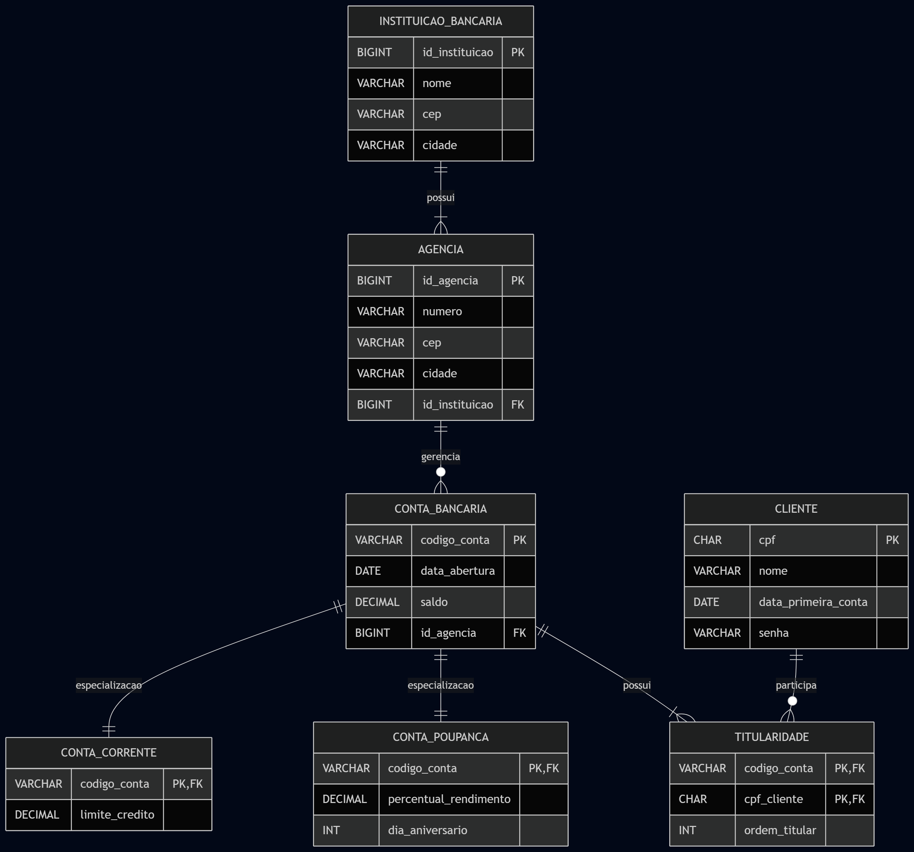
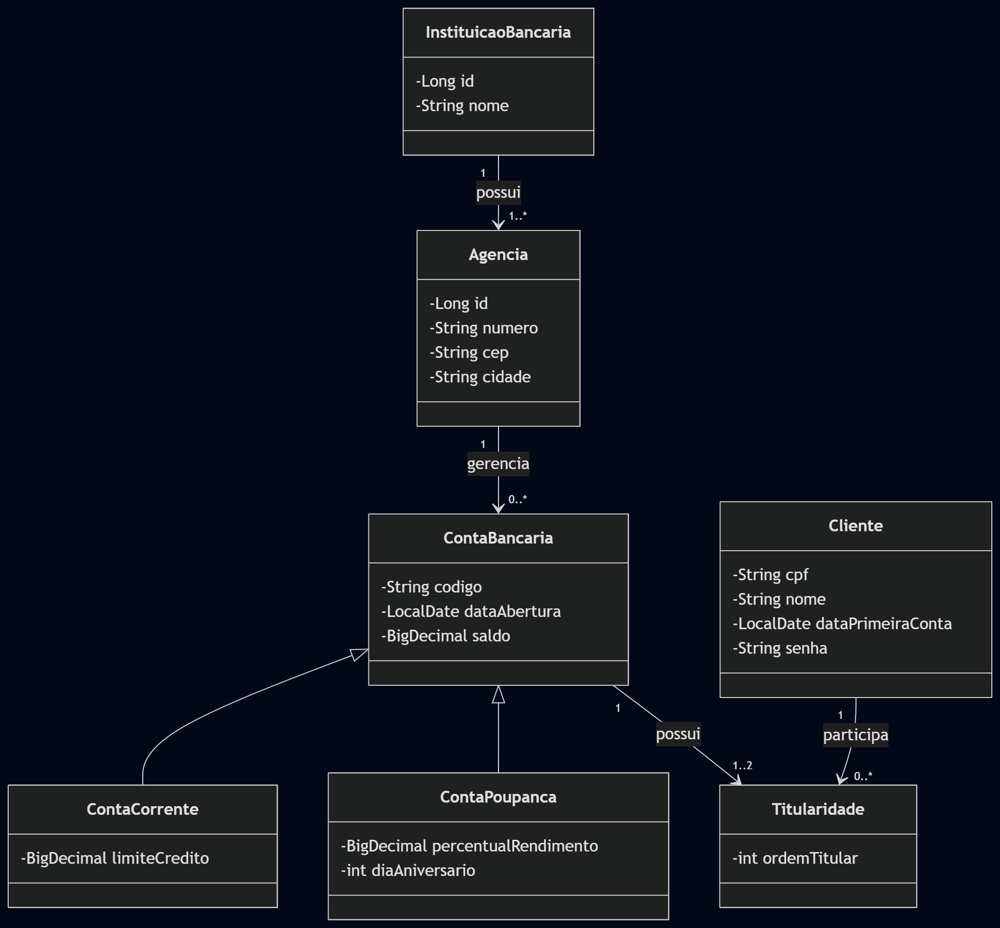

<div align="center">

# Sistema Bancário - Java Web


</div>

Projeto acadêmico de sistema bancário web com Java, Servlet/JSP e SQL Server.  
A aplicação foi estruturada em camadas (`Controller`, `Service`, `Persistence` e `Model`) e combina validações na aplicação com regras no banco de dados, por meio de stored procedures e constraints.

## Visão Geral

O sistema permite gerenciar clientes, agências e contas bancárias em um fluxo completo de operações administrativas e de cliente autenticado, incluindo conta conjunta com segundo titular.

## Funcionalidades

### Módulo de Clientes

- **Cadastro de cliente**: cria cliente com CPF, nome e senha.
- **Busca por CPF**: consulta dados de um cliente existente.
- **Login de cliente**: autentica o usuário e libera acesso ao painel.
- **Atualização de senha**: altera senha com validações de formato.
- **Exclusão de cliente**: remove cliente conforme regras de negócio.
- **Painel do cliente**: exibe dados do cliente logado e suas contas, com ações diretas sobre as contas.

### Módulo de Agências

- **Cadastro de agência**: registra agência com vínculo a uma instituição bancária.
- **Busca por ID**: consulta dados de uma agência específica.
- **Atualização de agência**: altera os dados cadastrados.
- **Exclusão de agência**: remove agência, respeitando integridade referencial.
- **Listagem de agências**: exibe todas as agências cadastradas.

### Módulo de Contas

- **Abertura de conta corrente**.
- **Abertura de conta poupança**.
- **Busca de conta por código**.
- **Listagem de contas por cliente (CPF)**.
- **Atualização de saldo**.
- **Atualização de limite de crédito (conta corrente)**.
- **Atualização de rendimento (conta poupança)**.
- **Atualização de dia de aniversário (conta poupança)**.
- **Exclusão de conta**.
- **Adição de segundo titular (conta conjunta)**.

## Regras de Negócio

- Senha de cliente obrigatória, com **8 caracteres** e pelo menos **3 dígitos**.
- CPF obrigatório para operações de cliente e conta.
- Saldo, limite e rendimento não podem ser negativos.
- Dia de aniversário da poupança deve estar entre **1 e 31**.
- Conta conjunta aceita no máximo **2 titulares**.
- Inclusão de segundo titular exige autenticação do titular atual (CPF e senha).
- Há restrições para exclusão quando há vínculo com conta conjunta.
- O código da conta é gerado com base em regra definida no banco de dados (agência, CPF(s) e dígito verificador).

## Tecnologias

- Java 17
- Jakarta Servlet / JSP
- JDBC (jTDS)
- SQL Server
- Maven (`mvnw`)
- Bootstrap 5

## Arquitetura

Fluxo principal:

`JSP -> Servlet -> Service -> DAO -> Stored Procedure -> SQL Server`

Camadas:

- `model`: entidades de domínio
- `controller`: entrada HTTP e navegação
- `service`: validações e regras de negócio
- `persistence`: acesso a dados e mapeamento
- `webapp/views`: interface JSP

## Modelagem

O projeto contém:

- Diagrama ER



- Diagrama de Classes



## Como Executar

1. Configure o banco com os scripts em `sql/`:

- `01_create_database.sql`
- `02_create_tables.sql`
- `03_stored_procedures.sql`
- `04_testes.sql`

2. Ajuste conexão em:

`src/main/java/com/lamego/sistema_bancario/persistence/GenericDAO.java`

3. Compile:

```bash
./mvnw clean compile
```

4. Gere o pacote:

```bash
./mvnw clean package
```

## Observações

- O projeto não possui foco em segurança da informação. Por esse motivo, não há criptografia de senhas no estado atual da aplicação.
- O fluxo de instituição bancária não está exposto como módulo completo no front-end.
- Projeto desenvolvido para fins didáticos na disciplina de Laboratório de Banco de Dados.
